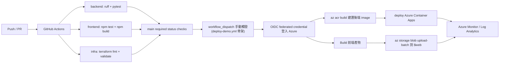

# CI/CD 流程

驗證實作於 `.github/workflows/ci.yml`，部署骨架位於
`.github/workflows/deploy-demo.yml`。

## CI 階段(已實作)

- **後端**:`ruff check`(lint)+ `pytest`(單元測試,mock 模式、免憑證、免網路)。
- **前端**:`npm ci` + `npm test` + `npm run build`(測試、TypeScript 型別檢查 + Vite 建置)。**Node 鎖 22 LTS**(避免非 LTS 版本在 CI 出意外)。
- **Infra**:`terraform fmt -check` + `terraform validate`。

## CD 階段(自動化路徑骨架)

- `deploy-demo.yml` 是自動化部署路徑的骨架(`workflow_dispatch` 手動觸發);
  **目前公開 demo 由 `docs/public_demo_runbook.md` 的手動流程(az CLI)部署**,
  這條 workflow 尚未實際執行過。
- 觸發時由 `environment` input 指定 GitHub Environment,並需提供 Azure resource
  group、ACR、Container App、frontend storage account 與 frontend origin 等部署目標。
- workflow 設計上透過 **OIDC federated credential** 登入 Azure,不保存長期雲端金鑰。
- 後端路徑:`az acr build` 建置並推送 image 到 Azure Container Registry,再更新 Azure Container Apps。
- 前端路徑:build 後以 `az storage blob upload-batch -d '$web' -s frontend/dist` 發布到 Azure Storage 靜態網站,與後端 release 可分開驗證。

## 加分細節

- 雲端認證用 **OIDC** 而非長期 access key。
- `main` 受 required status checks 保護:backend / frontend / infra 三個 CI job 全綠才可合入。
- CI 對 infra 執行 `terraform fmt -check` + `terraform validate`;雲端資源由手動 runbook(az CLI)建立,Terraform 作為可重建的資源描述。
- `deploy-demo.yml` 的 `verify` job 先跑 build / validate,通過後才進入 Azure OIDC 登入與部署 job(骨架設計,尚未實際執行)。
