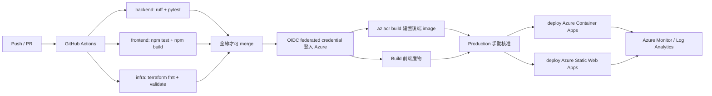

# CI/CD 流程

驗證實作於 `.github/workflows/ci.yml`，部署骨架位於
`.github/workflows/deploy-demo.yml`。

## CI 階段(已實作)

- **後端**:`ruff check`(lint)+ `pytest`(單元測試,mock 模式、免憑證、免網路)。
- **前端**:`npm ci` + `npm test` + `npm run build`(測試、TypeScript 型別檢查 + Vite 建置)。**Node 鎖 22 LTS**(避免非 LTS 版本在 CI 出意外)。
- **Infra**:`terraform fmt -check` + `terraform validate`。

## CD 階段(部署骨架已補)

- `deploy-demo.yml` 採 `workflow_dispatch` + `dry_run`，先做 build / validate，
  有 OIDC 與專案 secrets 時才進入真正 cloud 步驟。
- 真部署仍需人工觸發與環境核准，不會在這個 repo 內假裝「一 push 就已上雲」。
- GitHub Actions 透過 **OIDC federated credential** 登入 Azure，不保存長期雲端金鑰。
- 後端用 `az acr build` 建置並推送 image 到 Azure Container Registry，之後部署 Azure Container Apps。
- 前端走獨立路線 build 後部署 Azure Static Web Apps，與後端 release 可分開驗證。

## 加分細節

- 雲端認證用 **OIDC** 而非長期 access key。
- `main` 分支保護,CI 未過不能 merge。
- Terraform **plan 與 apply 分離**(plan 在 PR、apply 在核准後)。
- `dry_run=true` 可演練 deploy path 而不建立任何真實雲端資源。
