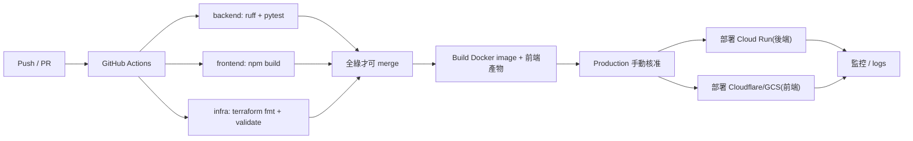

# CI/CD 流程

實作於 `.github/workflows/ci.yml`。

## CI 階段(已實作)

- **後端**:`ruff check`(lint)+ `pytest`(單元測試,mock 模式、免憑證、免網路)。
- **前端**:`npm ci` + `npm run build`(TypeScript 型別檢查 + Vite 建置)。**Node 鎖 22 LTS**(避免非 LTS 版本在 CI 出意外)。
- **Infra**:`terraform fmt -check` + `terraform validate`。

## CD 階段(設計)

- Staging 自動部署;Production 需人工核准。
- 前端 build 上傳靜態託管;後端部署 Cloud Run。

## 加分細節

- 雲端認證用 **OIDC** 而非長期 access key。
- `main` 分支保護,CI 未過不能 merge。
- Terraform **plan 與 apply 分離**(plan 在 PR、apply 在核准後)。
