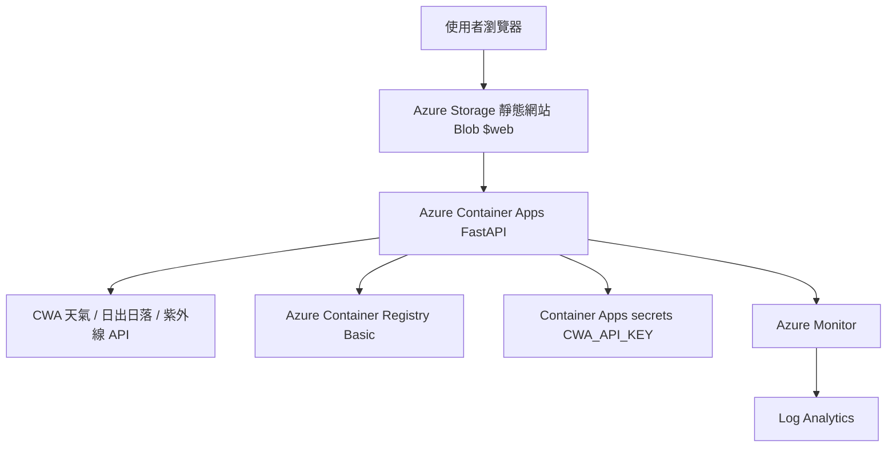
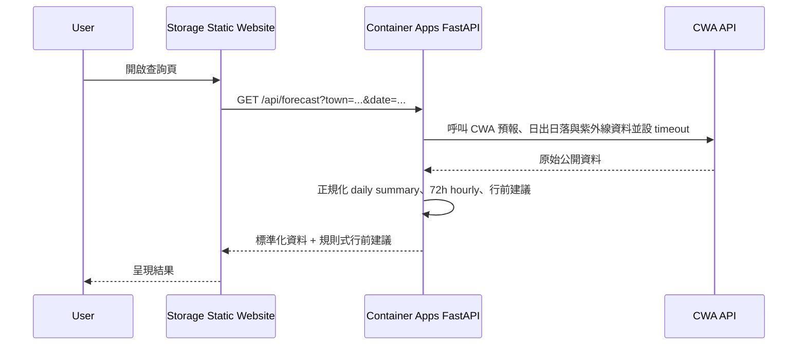

# 雲端架構

## 設計原則

- **交付物與實際部署一致**:本專案交付採純 Azure 。
- **部署元件保持精簡**:前端、後端、映像倉庫、secret 與監控都對應目前 demo 所需資源。
- **前端不直連第三方 API**:所有外部呼叫由後端代理,金鑰不進前端 bundle,並可統一加快取、限流、錯誤處理、監控;換資料源前端不動。

## 主架構圖(Azure)

## 成本與資源規格

- **前端**:Azure Storage 靜態網站,由 `$web` container 承接 React build 輸出、HTTPS 與靜態資產發布。
- **後端**:Azure Container Apps consumption plan,`minReplicas=0`,`maxReplicas=1`,單一 revision 跑 FastAPI 容器。
- **容器規格**:0.5 vCPU / 1 Gi 記憶體,符合學生作品 demo 與 scale-to-zero 的成本目標。
- **映像儲存**:Azure Container Registry Basic,由 GitHub Actions 透過 `az acr build` 建置與保存 image。
- **憑證管理**:先以 Container Apps secrets 保存 `CWA_API_KEY`,避免把 secret 寫入 repo 或 image。
- **訂閱假設**:以 Azure for Students 或學生可取得的低成本訂閱為基準,控制常駐成本接近零。

## 資料流:使用者查詢

## 資料集粒度正規化規則(API 契約)

- 目標日 **≤ 48h**:`F-D0047-093`(3h)聚合為當日摘要。
- 目標日 **> 48h**:`F-D0047-091`(12h)產日級摘要。
- `/api/forecast` 對外回傳**系統整理後的 daily summary**(高低溫、代表天氣、最大降雨機率、建議),不暴露兩資料集差異。
- 同一回應補上 72 小時逐時資料、日出日落與紫外線資訊,供前端一次呈現完整行前天氣面板。
