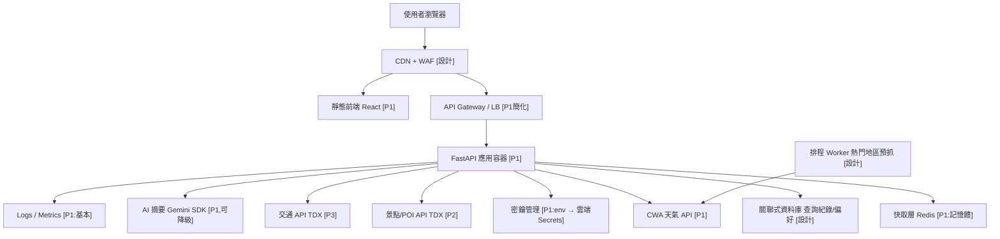
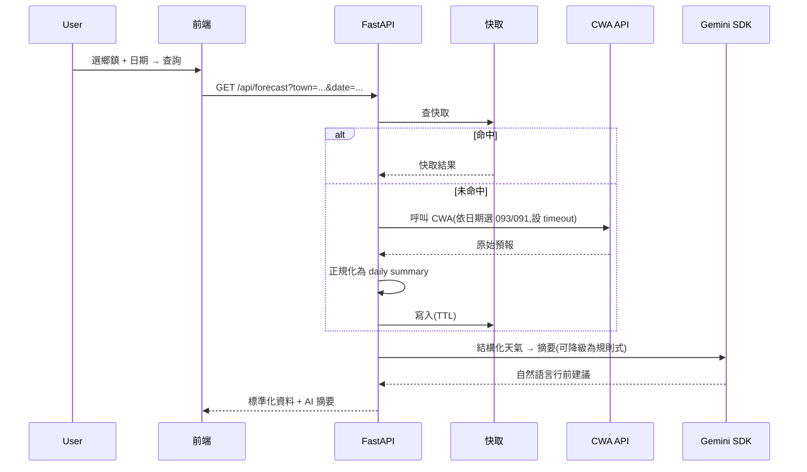

# 雲端架構

## 設計原則

- **平台中立為主圖**,AWS 為映射附錄:筆試看的是架構能力,不是雲服務名詞背誦;但仍落到具體服務以免流於空泛。
- **架構圖畫滿(展示 production 思維),Phase 1 部署精簡(必須真的能跑)**。標 `[P1]` 為第一版實際部署,`[設計]` 為圖上展示、後續才落地。
- **前端不直連第三方 API**:所有外部呼叫由後端代理,金鑰不進前端 bundle,並可統一加快取、限流、錯誤處理、監控;換資料源前端不動。

## 主架構圖(平台中立)

## AWS 服務映射(附錄)

| 中立元件 | AWS 對應 | 說明 |
|---|---|---|
| 靜態前端 | S3 + CloudFront | CDN + HTTPS |
| WAF | AWS WAF | 前緣防護 |
| API 容器 | ECS Fargate | 免管理主機 |
| LB | ALB | 對外暴露 API |
| 快取 | ElastiCache Redis | 熱門查詢 |
| 資料庫 | RDS PostgreSQL | 查詢紀錄/偏好 |
| 密鑰 | Secrets Manager | API key / 連線資訊 |
| 排程 | EventBridge Scheduler | 觸發 worker |
| 監控 | CloudWatch | logs / metrics / alarms |

> **實際 demo 部署**(single source of truth,見 `docs/iac_overview.md`)採 **Google Cloud Run(後端)+ Cloudflare/GCS(前端)**——真正免費、可長期提供公開 URL。AWS 映射為設計呈現用,不為 demo 付費。

## 資料流:使用者查詢

## 資料集粒度正規化規則(API 契約)

- 目標日 **≤ 48h**:`F-D0047-093`(3h)聚合為當日摘要。
- 目標日 **> 48h**:`F-D0047-091`(12h)產日級摘要。
- `/api/forecast` 對外回傳**系統整理後的 daily summary**(高低溫、代表天氣、最大降雨機率、建議),不暴露兩資料集差異。
