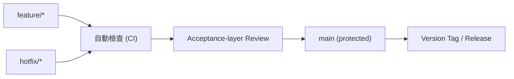

# 多人協作 Git 流程

> 雖為個人筆試專案,仍採用**可直接擴展到多人協作**的 trunk-based 流程。本 repo 的提交歷史包含真實的 feature branch 合併實例(`Merge feature/multiday-and-townships`);code review 由獨立的驗收層 agent 執行,審查紀錄保存在 `docs/dev-process/`,取代傳統的人工 PR review。

## 分支策略:trunk-based

- 變更從 `feature/*`(或 `hotfix/*`)開短命分支;歷史實例:`Merge feature/multiday-and-townships`。
- CI 通過 → 驗收層 review → 合併回 `main`。
- `main` 永遠維持可部署狀態;release 以 tag 管理(如 `v1.0.0`)。

## 為何不用傳統 Git Flow

- 本案規模不大,Git Flow 的 develop/release/hotfix 分支層級過重。
- trunk-based 更符合現代雲端交付節奏,評審通常欣賞簡潔務實。**選對「剛好的尺寸」本身就是成熟度訊號。**

## 規範

- Commit message 採 Conventional Commits(`feat:`, `fix:`, `docs:`, `chore:`, `test:`)。
- `main` 啟用 required status checks:CI 三個 job(backend / frontend / infra)全綠才可合入。
- PR 模板包含:變更摘要、測試方式、關聯需求(`.github/pull_request_template.md`,供多人協作時使用)。

## 對應 AI Driven 開發

本專案實際以多 AI 角色協作(規劃 / 實作 / 驗收審查),即為「多人協作」的真實體現;code review 由獨立驗收層 agent 完成並記錄於 `docs/dev-process/`。詳見 `docs/ai_driven.md`。
