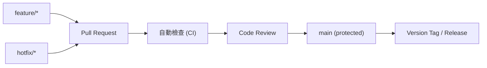

# 多人協作 Git 流程

> 雖為個人筆試專案,仍採用**可直接擴展到多人協作**的 Git flow,並在本 repo 真實執行(feature branch + PR + review 的提交歷史坐實流程圖),而非只畫一張圖。

## 分支策略:trunk-based

- 所有人從 `feature/*`(或 `hotfix/*`)開短命分支。
- 經 PR → CI 通過 → review → 合併回 `main`。
- `main` 永遠維持可部署狀態;release 以 tag 管理。

## 為何不用傳統 Git Flow

- 本案規模不大,Git Flow 的 develop/release/hotfix 分支層級過重。
- trunk-based 更符合現代雲端交付節奏,評審通常欣賞簡潔務實。**選對「剛好的尺寸」本身就是成熟度訊號。**

## 規範

- Commit message 採 Conventional Commits(`feat:`, `fix:`, `docs:`, `chore:`, `test:`)。
- `main` 開啟分支保護:需 PR、需 CI 綠燈、需至少一位 reviewer approve。
- PR 模板包含:變更摘要、測試方式、關聯需求。

## 對應 AI Driven 開發

本專案實際以多 AI 角色協作(規劃 / 實作 / 審查 / PR review),即為「多人協作」的真實體現;詳見 `docs/ai_driven.md`。
